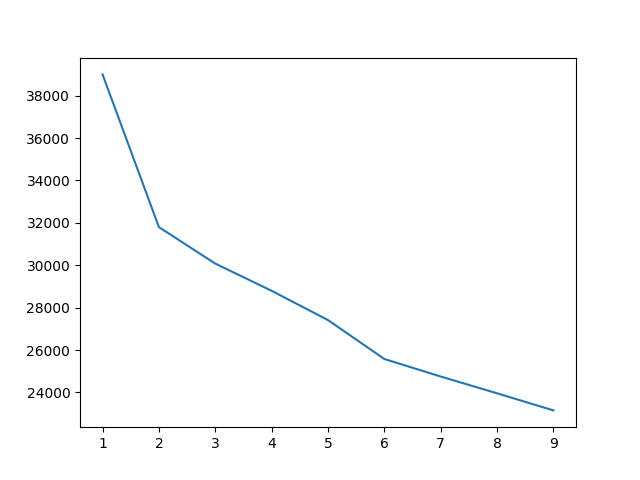
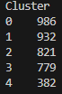

# 🛍️ Retail Customer Segmentation: Descobrindo Personas com K-Means


> *"Clientes com a mesma idade e renda compram de formas iguais? Ou será que o comportamento (frequência, uso de descontos) é o que realmente define quem eles são?"*

## 📌 Sobre o Projeto
Este projeto aplica técnicas de **Aprendizado Não Supervisionado (Clustering)** para segmentar a base de clientes de um e-commerce de vestuário. O objetivo foi fugir do óbvio (apenas idade/gênero) e identificar padrões ocultos de consumo para criar **Personas de Marketing** acionáveis.

Utilizamos o algoritmo **K-Means** para agrupar clientes baseados em 10 variáveis distintas, cruzando dados demográficos com comportamentais.

## 📂 O Dataset
- **Fonte:** Shopping Behavior Updated (Kaggle)
- **Linhas:** 3.900 Clientes únicos.
- **Variáveis Principais:**
  - **Demográficas:** Idade, Gênero.
  - **Financeiras:** Valor gasto (USD), Avaliação (Rating).
  - **Comportamentais:** Frequência de compra, Uso de Assinatura, Uso de Descontos, Tipo de Envio.

---

## 🛠️ O Processo (Etapas Técnicas)

### 1. Preparação dos Dados (Data Prep) 🧹
O K-Means é um algoritmo baseado em distância matemática, o que exigiu um tratamento rigoroso dos dados:
- **Tradução de Frequência:** A coluna `Frequency of Purchases` era texto ('Weekly', 'Annually'). Foi criado um dicionário de pesos para converter em valores numéricos anuais (Ex: Weekly = 52, Annually = 1).
- **Encoding:** Variáveis categóricas (Gender, Category, Subscription) foram transformadas em números via `LabelEncoder`.
- **Escalonamento (Scaling):** Como tínhamos variáveis com grandezas muito diferentes (Idade: 0-70 vs Gasto: 0-100), aplicamos o `StandardScaler` para colocar todos os dados na mesma régua matemática e evitar viés.

---

## 📊 Análises e Insights

### Passo 1: Definindo o Número de Grupos (Elbow Method)
Quantos tipos de clientes existem? Para responder isso matematicamente, testamos o algoritmo variando de 1 a 10 grupos e medimos o erro (inércia).

**Resultado:**
<div align="center">
  
</div>
<br>

**Conclusão da Análise:**
A curva deixa de cair bruscamente por volta do **K=3**, mas continua descendo suavemente. Optou-se por **K=5** para capturar mais nuances de comportamento (como clientes VIPs vs Clientes Novos), evitando generalizações excessivas que ocorreriam com apenas 3 grupos.

---

### Passo 2: O Equilíbrio dos Grupos
Após rodar o modelo com 5 clusters, verificamos se a divisão foi saudável.

**Resultado:**
<div align="center">
  
</div>
<br>

**Veredito:**
Os grupos ficaram bem balanceados (maioria entre 700-900 pessoas), com exceção do **Cluster 4** (aprox. 380 pessoas). Isso indicou a presença de um "Nicho Específico" que o modelo isolou propositalmente.

---

### 💎 O Deep Dive: Quem são as Personas?

Para interpretar os números do robô, analisamos as médias de cada grupo sob duas óticas: **Financeira** e **Comportamental**.

#### A. Perfil Financeiro (Dinheiro e Idade)
*Aqui analisamos quem gasta mais e a fidelidade histórica.*

```text
Cluster     Age         Purchase Amount (USD)  Review Rating    Previous Purchases
0        43.589249              80.193712       3.828702           26.020284
1        44.289700              39.097639       3.685515           24.009657
2        46.246041              60.123021       3.716443           36.629720
3        42.080873              58.667522       3.762901           14.204108
4        44.138743              58.921466       3.749476           25.392670
```

**Insight:** Percebemos que `Age` (Idade) e `Rating` são praticamente iguais em todos os grupos. O diferencial financeiro está no **Cluster 0 (Gasto Alto: $80)** e **Cluster 1 (Gasto Baixo: $39)**.

<br>

#### B. Perfil Comportamental
*Aqui descobrimos os hábitos que realmente diferenciam os clientes.*

```text
Cluster      Subscription Status    Discount Applied    Frequency of Purchases        Gender
0                   0.000000          0.000000               11.840771               0.410751
1                   0.000000          0.000000               11.977468               0.468884
2                   0.791717          1.000000               18.641900               1.000000
3                   0.517330          1.000000               13.005135               1.000000
4                   0.000000          0.201571               52.000000               0.549738
```

**Insight Revelador:**
O **Cluster 4** tem frequência **52.0**, ou seja, compram **toda semana**! Já os **Clusters 2 e 3** são compostos 100% por homens (`Gender = 1`) que usam descontos em 100% das compras.

---

## 🚀 Conclusão Final: As 5 Personas Identificadas

Com base nos dados cruzados acima, identificamos os seguintes perfis estratégicos:

### 🟢 Cluster 4: "Os Viciados Semanais"
* **Quem são:** O nicho isolado. Compram religiosamente toda semana (Frequência 52).
* **Comportamento:** Ticket médio ($58), não usam descontos e não possuem assinatura.
* **Estratégia:** Manter o hábito com novidades constantes. Não é necessário oferecer descontos para retê-los.

### 🔵 Cluster 2: "Homens VIP Caçadores de Oferta"
* **Quem são:** Homens (Gender=1), fieis (maior histórico: 36 compras).
* **Comportamento:** Sensíveis a preço: **100% usam desconto** e 79% têm assinatura.
* **Estratégia:** Manter no **Clube de Assinatura**. O desconto é o custo de retenção necessário para esse grupo de alto volume.

### 🔴 Cluster 0: "Elite Full-Price"
* **Quem são:** Maioria mulheres, **Ticket Médio Altíssimo ($80)**.
* **Comportamento:** Jamais usam descontos ou assinaturas (0.0).
* **Estratégia:** **Atendimento VIP e Exclusividade**. Ofertas agressivas podem desvalorizar a marca para elas.

### 🟡 Cluster 3: "Novos Exploradores Econômicos"
* **Quem são:** Homens (Gender=1), mas com histórico baixo (14 compras).
* **Comportamento:** Assim como os VIPs, **100% usam desconto**, mas ainda não têm assinatura consolidada.
* **Estratégia:** **Upsell**. Tentar convertê-los em assinantes para que virem o "Cluster 2" no futuro.

### 🟠 Cluster 1: "Casuais Econômicas"
* **Quem são:** Maioria mulheres com **Ticket Baixo ($39)**.
* **Comportamento:** Frequência esporádica e sem uso de descontos.
* **Estratégia:** Promoções de **Volume** ("Leve 3 Pague 2") para tentar subir o ticket médio artificialmente.

---